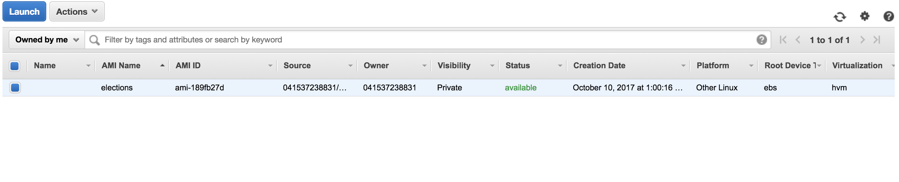

# Bootstrapping a server

To bootstrap a new server, log into the AWS console and create a new EC2 server using the AMI for elections.



Once the server is bootstrapped and has an IP address, use the pem file in the [Private Eye repo](https://github.com/The-Politico/private-eye) to login to the server as such:

```
ssh ubuntu@ip-address-of-server -i path/to/private-eye/politico-east.pem
```

Once you’re in the server:

### Get Your SSH key on there

You can't rely on your pem file to get into the server; Fabric depends on your SSH key having ssh access to run its commands. So you'll need to copy your SSH key to the server.

1. On your local machine, run `pbcopy < ~/.ssh/id_rsa.pub`
2. SSH into the server with the pem file, as above
3. `nano ~/.ssh/authorized_keys` (or vi if that’s your thing)
4. Paste your ssh key on the bottom line
5. Save the file and disconnect from the server (`ctrl+d`).
6. Try to ssh into the server with `ssh ubuntu@ipaddress`

### Getting the app on the server

Okay, now you’re ready to (attempt to) get the app on the server.

First, double check a few variables in `server_config.py`. `SERVER_PYTHON` should match the version you’re running, such as `python3`. `PRODUCTION_SERVERS`/`STAGING_SERVERS` should have the IP addresses of the servers in the lists.

> For the following commands, `staging` represents the server you want to target (either `staging` or `production`) and `master` represents the branch you want to deploy.

Run `fab staging master servers.setup`

Then, install the confs with `fab staging master servers.deploy_confs`.

Check your site and see if it works! If you get an nginx error or it hangs, start checking your logs and welcome to server hell!

### Updating the server

To update the server with changes in the repo, first ensure that all of your changes are pushed to Github. Then, run `fab staging master deploy_server`.

### Running commands on the server

To run any fab command on the server from your local machine, use `servers.fabcast`. For example, if you want to run the `data.bootstrap_db` command on the server, you would run:

```
fab staging master servers.fabcast:data.bootstrap_db
```

Note that fabcast can only run fabric commands.

### Upstart Services

On the server, the app basically functions through two upstart services: `app` and `deploy`. The `app` service starts uWSGI to serve Django through nginx. The `deploy` service runs the results daemon.

In the `confs` folder, you will see the upstart configuration files for those two. Hopefully, you'll never need to touch them.

You can control them through Fabric. There are three commands:

1. `fab staging master servers.start_service:name_of_service`
2. `fab staging master servers.stop_service:name_of_service`
3. `fab staging master servers.restart_service:name_of_service`
